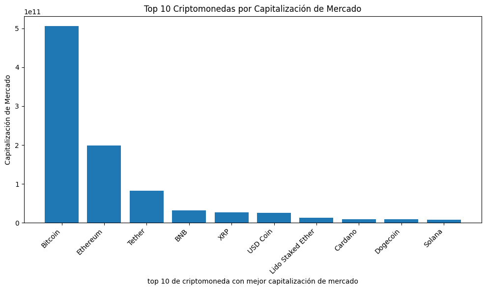
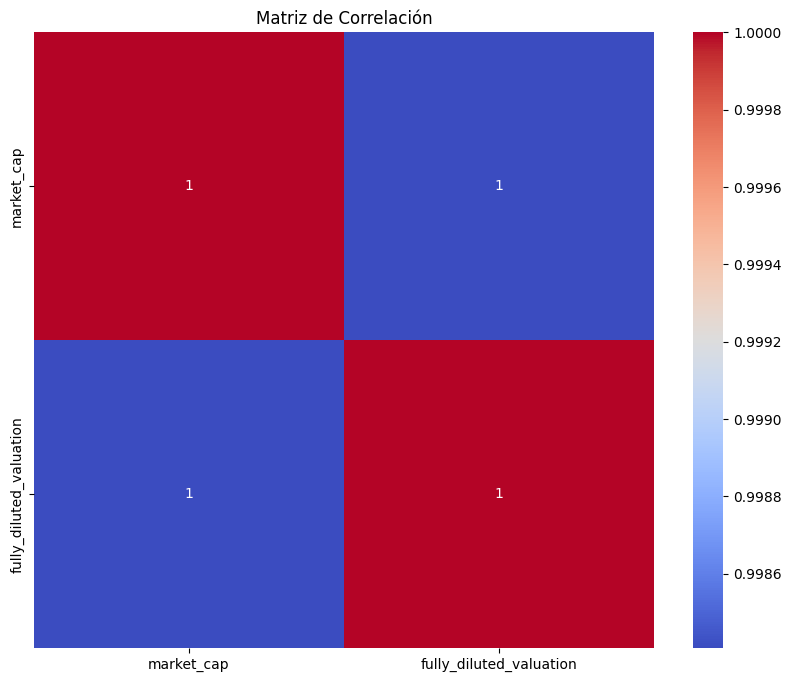

# criptomonedas

Análisis exploratorio del mercado de criptomonedas utilizando datos de la API CoinGecko, con el fin de descubrir tendencias, hallazgos que contribuyan a la toma de decisiones.

## Índice
1. [KPI's ](#id1)
2. [Fuentes de datos](#id3)
3. [EDA - Análisis Exploratorio de Datos](#id4)
5. [Informe](#id5)

## 1. KPI's

>[!IMPORTANT]
>
>Aumentar la inversión del bitcoin en un 15% para el próximo mes.

>[!IMPORTANT]
>Aumentar la inversión del Tether (USDT) en un 10% para el próximo mes.
>.

>[!IMPORTANT]
>
>Realizar una inversion de 500 millones en la categoría con mayor tendencia en el mercado para el próximo mes.

## 2. Fuente de datos

[API CoinGecko](https://www.coingecko.com/es/api/documentation)

 - Endpoint: **GET coins/market** para otener el listado de todas las monedas con lo datos del mercado de monedas (precio, capitalización de mercado, volumen). 

- Endpoint: **GET coins/{id}/market_chart** para obtener toda la info de las criptos de bitcoin y tether. 

 - Endpoint: **GET coins/categories** lista todas las categorias de criptos con sus datos de mercado.

**Diccionario de Datos**

market_cap criptomonedas
| Columna | Descripción  |
|:------------- |:-------------| 
| id         |Identificador de la moneda          | 
| symb         | Símbolo de la moneda         |
| name         | Nombre de la criptomoneda          |
| image         | url donde se halla una imagen ilustrativa que representa la cripto          |
| current_price | Precio actual         |
| market_cap         | Capitalización del mercado. Precio de la Criptomoneda × Cantidad Total de Criptomoneda en Circulación. Donde "Precio de la Criptomoneda" es el precio actual de una unidad de la criptomoneda y "Cantidad Total de Criptomoneda en Circulación" es la cantidad total de unidades de esa criptomoneda que están siendo negociadas en el mercado.          |
| market_cap_rank         | El rango de capitalización de mercado de una criptomoneda se refiere a la posición relativa de esa criptomoneda en comparación con otras criptomonedas en función de su capitalización de mercado.         |
| fully_diluted_valuation         |  La valoración totalmente diluida es una representación estadística del valor máximo de un proyecto de criptomoneda, suponiendo que todos sus tokens ya estén en circulación. FDV = Precio actual x Cantidad máxima (o cantidad total si la cantidad máxima no es válida). La capitalización de mercado (valoración) si la cantidad máxima de una moneda está en circulación. Tenga en cuenta que pueden pasar 3, 5, 10 o más años hasta que se alcance el FDV según el calendario de emisión.     |
| total_volume         | Se refiere a la cantidad total de una criptomoneda que se ha negociado en un período de tiempo específico, generalmente en un día. Es la suma de todas las transacciones realizadas en esa criptomoneda durante ese período. El volumen es una métrica crítica en el análisis técnico y fundamental, ya que indica la actividad comercial y la liquidez de una criptomoneda. Un alto volumen puede indicar un interés significativo y una alta liquidez, mientras que un volumen bajo podría sugerir una actividad comercial limitada. |
| high_24h         |Máximo en 24 |
| low_24h         | Mínimo en 24 |
| price_change_24h              | Cambio de precio en 24h|
| price_change_percentage_24h         | Porcentaje del cambio de precio en 24h |
| market_cap_change_24h         | Cambio de la capitalización de mercado en 24hs | 
| market_cap_change_percentage_24h         | Porcentaje de la cambio de la capitalización de mercado en 24hs |
| circulating_supply     | Este campo representa la cantidad de la criptomoneda que está actualmente en circulación y en manos de los inversores. |
| total_supply     | Este campo representa la cantidad total de la criptomoneda que existe en el momento actual, incluyendo la que está en circulación y la que aún no ha sido liberada. | 
| max_supply         | Este campo representa la cantidad máxima posible de la criptomoneda que podría existir en total. No todas las criptomonedas tienen un suministro máximo definido. |
| ath |  "ATH" significa "All-Time High" en inglés, que se traduce como "Máximo Histórico" en español. Se refiere al precio más alto jamás alcanzado por una criptomoned.| 
| ath_change_percentage         | Este es el porcentaje de cambio que representa la diferencia entre el precio actual de una criptomoneda y su máximo histórico (ATH), expresado como un porcentaje. | 
| ath_date        | Esta es la fecha en la que la criptomoneda alcanzó su máximo histórico (ATH). Indica cuándo se registró el precio más alto para esa criptomoneda. |
| atl      |   "ATL" significa "All-Time Low", que se traduce como "Mínimo Histórico" en español. Se refiere al precio más bajo jamás alcanzado por una criptomoneda. |
| atl_change_percentage       | Este es el porcentaje de cambio que representa la diferencia entre el precio actual de una criptomoneda y su mínimo histórico (ATL), expresado como un porcentaje.  |
| atl_date      |  Esta es la fecha en la que la criptomoneda alcanzó su mínimo histórico (ATL). Indica cuándo se registró el precio más bajo para esa criptomoneda. |
| roi     |  El ROI es una métrica que indica la rentabilidad de una inversión en función de la ganancia generada en relación con el costo inicial de la inversión. El ROI te proporciona información sobre el rendimiento de tu inversión en términos porcentuales. Un ROI positivo indica que has obtenido ganancias, mientras que un ROI negativo indica pérdidas.|
| last_updated     |  Última actualización |
| roi.times     | Esta expresión podría hacer referencia a la cantidad de veces que el ROI excede el costo inicial de la inversión. Por ejemplo, si el ROI es 2, significa que la inversión ha duplicado su valor.  |
| roi.currency     |   Esta expresión se refiere a la moneda en la que se está calculando el ROI. Dado que las criptomonedas y las inversiones pueden estar denominadas en diferentes monedas, esta propiedad podría indicar la moneda específica en la que se está realizando el cálculo del ROI.|
| roi.percentage     |  Esto probablemente se refiere a la representación del ROI en forma de porcentaje. El ROI se expresa comúnmente en términos porcentuales para indicar cuánto ha aumentado o disminuido el valor de la inversión en relación con su costo inicial.  |

categorias
| Columna | Descripción  |
|:------------- |:-------------| 
| id         | Este es un identificador único de la categoria. | 
| name       | Indica el nombre de la categoria. | 
| market_cap         | La capitalización de mercado (market cap). Se calcula multiplicando la cantidad de monedas en circulación por el precio actual de cada moneda en el mercado. Es una medida importante para comprender el tamaño relativo de una categoria de criptomoneda en comparación con otras. | 
| market_cap_change_24h         | Cambio en la capitalización de mercado de la criptomoneda en las últimas 24 horas | 
| content         | El contenido se refiere a información relevante o destacada sobre la criptomoneda. Puede incluir noticias, actualizaciones técnicas o cualquier otro tipo de contenido informativo relacionado con la moneda. | 
| top_3_coins         | Esta sección probablemente enumera las tres principales criptomonedas del mercado en ese momento. Puede ser una lista que enumere las criptomonedas más grandes por capitalización de mercado o por otro criterio específico.| 
| volume_24h         | volume_24h: El volumen de 24 horas es la cantidad total de una criptomoneda que se ha negociado en todas las bolsas durante las últimas 24 horas. Este valor muestra la liquidez y la actividad comercial de la moneda en un período de tiempo determinado. | 
| updated_at         | Indica el momento en que se actualizó la información en la entrada. Esto es importante en un mercado tan volátil como el de las criptomonedas, ya que los datos pueden cambiar rápidamente y es crucial conocer la temporalidad de la información presentada. | 

## 3. EDA - Análisis Exploratorio de Datos

Se realizó el análisis explotatorio de los datos, se describen los mismos, detectando outliers sin eliminarlos, se sigue por la descripción de la distribución de sus datos y se ofrecen visualizaciones que contribuyen a la labor de conclusiones que sean útiles para los indicadores de rendimientos y la toma de decisiones oportunas.
El análisis exploratorio de cada dataset se halla en la carpeta titulada "eda".
Se han selecionado un top de 10 criptomonedas las mejores establecidas en el mercado por su valoración de capitalización de mercado comparado con el resto de las criptomonedas.

  

Asimismo se presenta una relación fuertemente positiva con las variables "market_cap" y "fully_diluted_valuation" son muy cercanas a 1 (0.998408), tienden a moverse en la misma dirección de manera lineal. En otras palabras, cuando el valor de una variable aumenta, el valor de la otra variable también aumenta en proporción constante, y viceversa.

  

Hay una tendencia de Layer 1 (L1), seguida de los Smart Contract Platform y las Stablecoins en lo que refiere a categorias de criptomonedas donde, nuestro enfoque se centra en el bitcoin y el etherium

El precio de Bitcoin (BTC) a la fecha, siendo 22/08/2023 20:13 hs. es de 26034.0 US$   con una cantidad en circulación de 19 millones BTC, Bitcoin cotiza a una capitalización de mercado de 506.911.940.900 US$ posicionandose en el primer lugar. En cuanto al Etherium, se cotiza a 1653,27 US$. Su suministro de criptos es de 120 millones ETH y cotiza a una capitalización de mercado de 198.808.099.021 US$.

